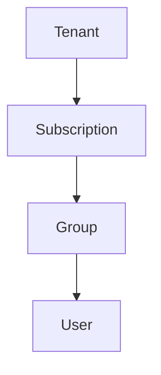

# Entra ID
Also know as Active Directory Domain Service(AD DS) previously. It deals only with authentication and identity. This is covered in [SC-300](https://learn.microsoft.com/en-us/credentials/certifications/identity-and-access-administrator/?practice-assessment-type=certification).

## Capabilities
- Configuring access to applications
- Configuring single sign-on (SSO) to cloud-based SaaS applications
- Managing users and groups
- Provisioning users
- Enabling federation between organizations
- Providing an identity management solution
- Identifying irregular sign-in activity
- Configuring multi-factor authentication
- Extending existing on-premises Active Directory implementations to Microsoft Entra ID
- Configuring Application Proxy for cloud and local applications
- Configuring Conditional Access for users and devices

## Supplementary Notes
1. Microsoft 365 comes with Entra ID.
2. Entra ID is a cloud-based identity and access management service.
3. Entra ID have tiers
    - Free
    - Microsoft Entra ID P1
    - Microsoft Entra ID P2
    - Microsoft Entra ID Governance
4. Unlike AD it doesn't store Computer name but device class.
5. All Tenant have a onmicrosoft.com domain name. It is the default domain name. You can add custom domain name.
6. AD is NOT DEAD, you can use it on computers; i.e even installing into VM (just not on drive C:).

## Entra vs AD
1. Microsoft Entra ID is primarily an identity solution, and it’s designed for internet-based applications by using HTTP (port 80) and HTTPS (port 443) communications.
2. Microsoft Entra ID is a multi-tenant directory service.
3. Microsoft Entra users and groups are created in a flat structure, and there are no OUs or GPOs.
4. You can't query Microsoft Entra ID by using LDAP; instead, Microsoft Entra ID uses the REST API over HTTP and HTTPS.
5. Microsoft Entra ID doesn't use Kerberos authentication; instead, it uses HTTP and HTTPS protocols such as SAML, WS-Federation, and OpenID Connect for authentication, and uses OAuth for authorization.
6. Microsoft Entra ID includes federation services, and many third-party services such as Facebook are federated with and trust Microsoft Entra ID.