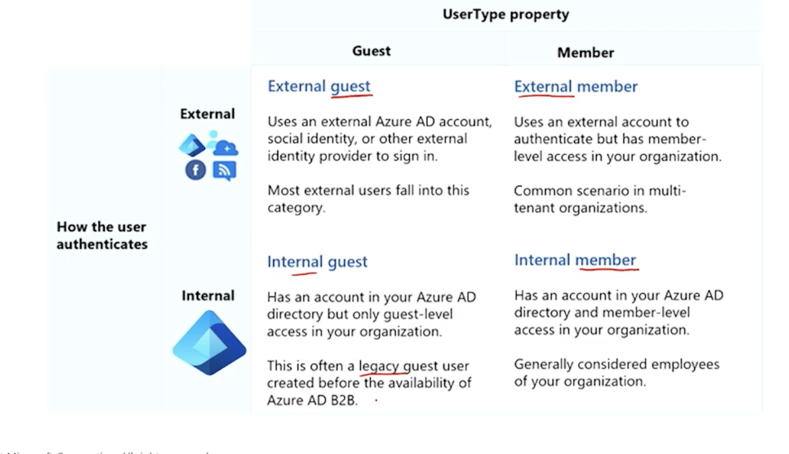

# External ID
[link](https://learn.microsoft.com/en-us/entra/external-id/)

## One-time password
1. If invited as guest, these conditions apply to get one-time password sent:
- They don't have a Microsoft Entra account.
- They don't have a Microsoft account.
- The inviting tenant didn't set up federation with social (like Google) or other identity providers.
- They don't have any other authentication method or any password-backed accounts.
- Email one-time passcode is enabled.

## Invite user
1. Required email + given external invite email. These two will be verified together, if they are different the user will be rejected to redeem the invitation.

## User Type
Take note only invited partner will be Guest, when employee (regardless is external or not) is created it will be Member.

## External collaboration settings
1. I can enable/disable guest self-service sign up for the collaborated organization.
2. Can enable only specific user to specific admin roles (other than Global Admin) to invite guest.
2. I can add specific domains of external users to be allowed or denied.
