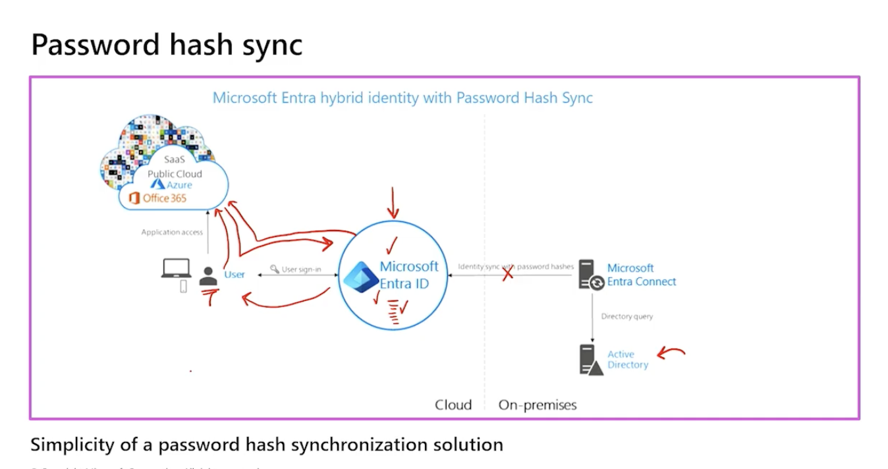
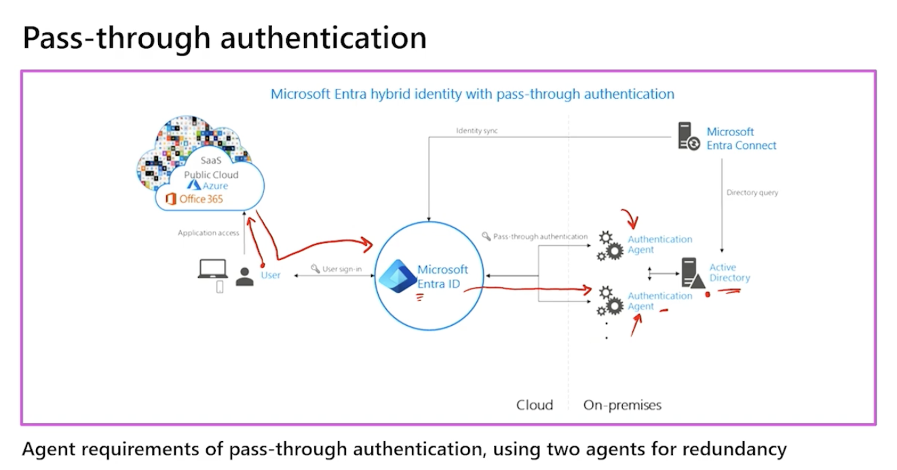
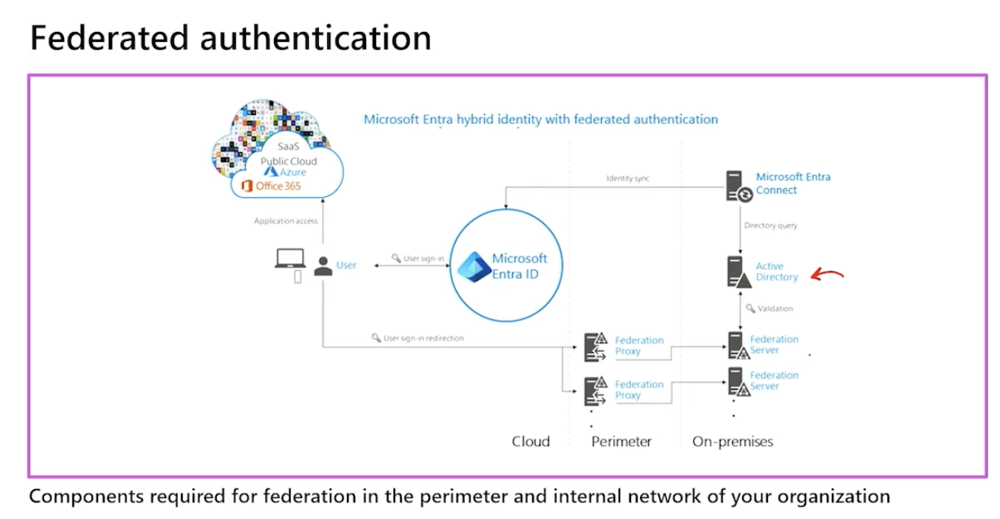

# Hybrid

## Entra Connect Sync vs Entra Cloud Sync
1. [What is Microsoft Entra Connect cloud sync](https://learn.microsoft.com/en-us/entra/identity/hybrid/cloud-sync/what-is-cloud-sync)
2. Cloud Sync uses and agent and store in Microsoft Entra Cloud database.
3. Connect Sync needs a dedicated machine to store with DB, but can handle millions of users.
3. If the scenario requires simplicity, multiple active agents, or isolated multi-forest connections, pick Cloud Sync. If it requires complex, legacy database-level rule manipulation or millions of objects, pick Connect Sync.

| Architectural Property | Entra Connect Sync | Entra Cloud Sync |
| --- | --- | --- |
| On-Prem Server Footprint | Heavy. Requires high CPU/RAM, full software install, and an SQL Database. | Extremely light. A tiny, stateless Windows service agent. |
| High Availability (HA) | Complex. Only supports one Active server and one cold/passive "Staging Mode" backup server. | Simple. Supports multiple active agents simultaneously out-of-the-box for active-active redundancy. |
| Sync Interval | Hardcoded to every 30 minutes (by default via the scheduler delta script). | High-frequency. Changes pull from the cloud queue significantly faster. |
| Complex Transformations | Deep support for advanced, custom declarative provisioning rules via the Sync Rules Editor. | Basic attribute mapping and scoping filters configured via the cloud portal web interface. |
Object Limit,Scalable up to millions of objects if backed by a dedicated SQL Server.,"Supports up to 50,000 objects per directory sync profile."

## Microsoft AD has 3 authentication sign-in methods.
1. Password Hash Sync (PHS)
2. Pass-through Authentication (PTA) - connect sync you install agent "Microsoft Entra Pass-Through Authentication Agent.", Install "Microsoft Entra Private Network Connector" for HA/Load balancing.
3. Federation (AD FS)
4. Not configured (Cloud only - no hybrid integration)

### Cheat sheet
[ Object Synchronization Engine ]
  ├── Entra Connect Sync (Monolith, local SQL DB, complex rules editor)
  └── Entra Cloud Sync   (Micro-agent, cloud-hosted DB, simple web portal)

[ Authentication Runtime Method ]
  ├── Password Hash Sync (PHS) -> Supported by BOTH Sync Engines (Resilient)
  └── Pass-Through Auth  (PTA) -> Handled by native PTA Agent (Connect Sync) 
                                  OR via Standalone Private Network Connector (Cloud Sync)

## Password Hash Sync (PHS)
1. Most recommended sync method.
2. For online Password reset/self service password reset.
3. Even if on-prem AD is down, user can still login to cloud using their password hash. Because the Entra server stores the hash value.

## Passthrough Authentication (PTA)
1. User login to cloud will trigger a request to on-prem AD agent.
2. Authentication happens on-prem.
3. Only "Valid password" or "Invalid password" sent back to cloud. No password hash stored in cloud.
4. Support Online Password reset / self service password reset.
5. Best to have at least 2 agents, to prevent single point of failure.

## Federation (AD FS)
1. User login to cloud will trigger a request to on-prem AD FS server.
2. Authentication happens on-prem.
3. Only "Valid password" or "Invalid password" sent back to cloud. No password hash stored in cloud.
4. Support Online Password reset / self service password reset.

### Federation - The Agent Split: Connect Sync vs. Cloud Sync
Because federation requires managing token-signing certificates, trust relationships, and custom claim mappings, the two hybrid syncing tools handle it differently:

A. Entra Connect Sync (The Integrated Monolith)
The Connection: Connect Sync features a highly integrated, automated setup wizard.

The Mechanics: If you check the box for "Federation with AD FS" inside the monolithic installer, Connect Sync will use its local database and broad administrative network access to automatically log into your on-premises AD FS servers. It handles creating the relying party trusts, matching the attributes, and automatically rotating the token-signing certificates between your on-premises farm and the Entra cloud automatically.

B. Entra Cloud Sync (The Decoupled Agent)
The Connection: Entra Cloud Sync fully supports federated user domains, but it behaves as a completely decoupled component.

The Mechanics: The lightweight Cloud Sync Provisioning Agent is completely blind to your AD FS infrastructure. It performs its single task: reading user object delta streams from the Active Directory domain controllers and pushing them to the cloud database.

The Setup: If you choose to use Cloud Sync with Federation, you do not use the sync agent to configure your logon path. You deploy your on-premises AD FS server farm independently and configure the federation trust manually via PowerShell (Connect-MgGraph / New-MgDomainFederationConfiguration) or the Entra Portal web dashboards.