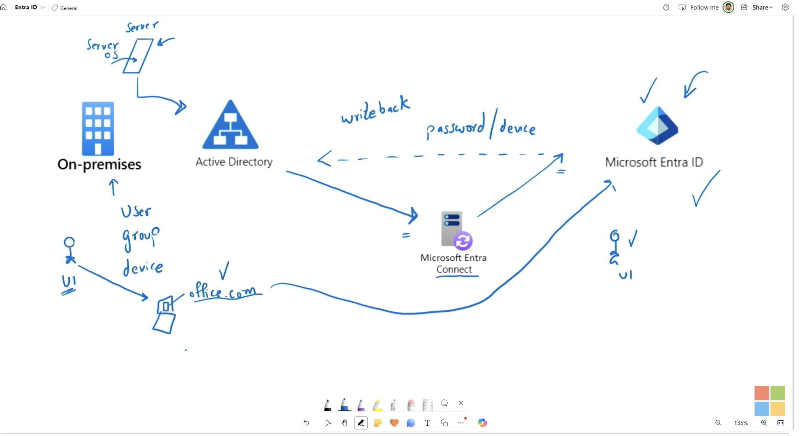
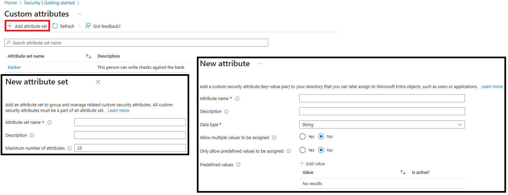

## Users
1. **Cloud identities** - These users exist only in **Microsoft Entra ID**. Examples are administrator accounts and users that you manage yourself. Their source is Microsoft Entra ID or External Microsoft Entra directory if the user is defined in another Microsoft Entra instance but needs access to subscription resources controlled by this directory. When these accounts are removed from the primary directory, they're deleted.
2. **Directory-synchronized identities** - These users exist in an on-premises Active Directory. A synchronization activity brings these users into Microsoft Entra ID. **Microsoft Entra Cloud Sync** is the recommended synchronization tool for most organizations—it uses a lightweight cloud-managed agent and supports multiple disconnected forests. **Microsoft Entra Connect Sync** remains available for complex scenarios such as device synchronization or groups with more than 50,000 members. Their source is **Windows Server AD**.
3. **Guest users** - These users exist **outside** your organization. Examples are accounts from other cloud providers and Microsoft accounts. Their source is Invited user. This type of account is useful when external vendors or contractors need access to your organization's resources. Once their help is no longer necessary, you can remove the account and all of their access. 

### Add User
1. Best managed in **entra.microsoft.com**
2. Cloud Identities can include properties like:
    - Job title
    - Parental Controls
    - Usage location (required for licensing purposes)
    - Custom Security Attribute 
    
3. Support custom domain, but have to be included first.

### Delete Users
1. Soft Delete - Users are soft deleted and can be restored within 30 days.
2. Hard Delete - Users are hard deleted and cannot be restored.
3. Permission required to restore or delete users is **User Administrator** or **Global Administrator** or **Partner Tier 1 Support** or **Partner Tier 2 Support**.

### Automation (System for Cross-Domain Identity Management - SCIM)
[read](https://learn.microsoft.com/en-us/training/modules/create-configure-manage-identities/12-explore-automatic-user-creation)

## Groups
1. Group types:
    - **Microsoft 365 Groups** - Groups that are used to collaborate with other users. They have a shared mailbox, calendar, and other resources. This option also lets you give people outside of your organization access to the group. This option can only _add_ users, not groups or devices.
    - **Security Groups** - Groups that are used to manage access to resources. Members of a security group can include users, devices, and service principals. **This option requires a Microsoft Entra administrator.**
2. Membership types:
    - **Assigned** - members are added and maintained manually.
    - **Dynamic User** - Users are added and removed automatically based on rules that evaluate user attributes such as department, job title, or location. **Requires P1/P2 license.**
    - **Dynamic Device** - Devices are added and removed automatically based on rules that evaluate device attributes such as department, job title, or location. **Requires P1/P2 license.**
    - **NOTE**: Users cannot be added manually if it is a dynamic membership type.
3. "Entra roles can be assigned to group" toggle
    - Is immutable once created
    - User cannot use **dynamic**, **nested** or **Microsoft 365** group for the toggle to be true.
    - User must be assigned manually to the group to prevent user to have highest privilege.

### Group nesting
1. There are 2 methods to create nested groups:
    - **Adding Groups as Members**: Directly add one group (group A) as a member of another group (group B). Group A's members automatically inherit the permissions of Group B.
2. Group nestings are not allowed if:
    - Group is a dynamic group. E.g. Group A is non-dynamic, Group B is dynamic. Then Group B can be added as a member of Group A. But a non-dynamic Group A cannot be added as a member of a dynamic Group B.
    - Group is a Microsoft 365 Group. Group nesting is not allowed for Microsoft 365 groups.
    - Group has "Entra roles can be assigned to group" toggle. E.g. Group A has "assign role" toggled as true, Group B is non-dynamic and no role-assigned. Then Group B can be added as a member of Group A. But a role-assigned Group A cannot be added as a member of Group B (non-dynamic and no role-assigned). 

## Microsoft Entra joined devices
[Read up](https://learn.microsoft.com/en-us/training/modules/create-configure-manage-identities/7-configure-manage-device-registration)
1. Any organization can deploy Microsoft Entra joined devices no matter the size or industry. 
2. Controlled with Mobile Device Management. Example: Microsoft Intune.
3. Can join as hybrid with on-prem AD.
4. No longer supports device writeback. Use **Cloud Kerberos Trust** which allows Microsoft Entra joined and hybrid joined devices to authenticate to on-premises resources without requiring device objects to be written back to on-premises Active Directory.
5. Conditional Access is required for device registration.
6. Windows 10/11 Professional/Enterprise/Education are supported.
7. Windows 10/11 Home are NOT supported.

### Microsoft Intune: The Endpoint Manager
1. Microsoft Intune is the actual **Mobile Device Management (MDM)** and **Mobile Application Management (MAM)** platform. 
2. It is responsible for securing the physical device and the corporate data on it.
3. Intune operates on two different levels depending on whether the phone is corporate-owned or personal (BYOD - Bring Your Own Device):  
    A. Mobile Device Management (MDM) – Device Centric, Used typically for corporate-owned devices.
    - You "enroll" the entire phone into Intune.  
    - Control: Full control. IT can force a device-wide PIN, push specific VPN and Wi-Fi profiles, block the app store, and completely factory-reset (wipe) the phone if it gets lost.

    B. Mobile Application Management (MAM) – Data Centric, Used typically for personal devices (BYOD).
    - You don't enroll the phone; instead, Intune manages only the apps (like Outlook, Teams, or custom corporate Java apps wrapped with the Intune SDK).
    - Control: Restricted to corporate data boundaries. It can block you from copying text out of corporate Outlook and pasting it into personal WhatsApp. If you leave the company, IT performs a Selective Wipe—deleting only the corporate emails and files, leaving your personal family photos completely untouched.

### Work together
1. The Request: The user hits Exchange Online.
2. The Identity Check: Entra ID triggers a Conditional Access policy and routes them to Microsoft Authenticator to prove their identity via MFA.
3. The Endpoint Check: Simultaneously, Entra ID asks Microsoft Intune: "Is this device marked as compliant? Is it encrypted? Does it have a PIN?"
4. The Verdict: If the user passes the Authenticator challenge AND Intune confirms the device is healthy, Entra ID grants the access token.
5. Overall: Authenticator handles the trust of the human, while Intune handles the trust of the machine.

## Hybrid Nightmare

| Feature | Entra Registered (BYOD) | Entra Joined (Cloud-Native) | Hybrid Entra Joined |
| :--- | :--- | :--- | :--- |
| **Primary Audience** | Personal laptops, mobiles (iOS/Android) | New laptops, remote-first workforce | Existing on-prem machines, legacy environments |
| **Identity Master** | Personal account (with a cloud shadow) | Entra ID (Cloud-only) | On-Prem Active Directory |
| **Management Tool** | Intune MAM (App-level security) | Intune MDM (Modern management) | Group Policies (GPOs) + Intune Co-management |
| **DC Line-of-Sight?** | No | No | Yes (Required to log in) |

1. Microsoft's explicit recommendation for new environments is **Entra ID Joined (Cloud-Native)**. Thanks to modern protocols like Kerberos Cloud Trust, a purely cloud-joined laptop can still access old on-prem printers and network shares seamlessly without ever being joined to the local Active Directory domain.
2. How the Bridge Works for Kerberos Trust. Instead of forcing you to build a massive, complex on-prem Certificate Authority infrastructure (PKI) to issue certificates to your cloud endpoints, Kerberos Cloud Trust allows your local Domain Controller to act as a consumer of tokens issued by Entra ID.
    1. Your laptop authenticates to Entra ID (via Windows Hello for Business or FIDO2 keys).
    2. Entra ID hands your laptop a "partial" ticket.
    3. Your laptop takes that token and shows it to your on-prem Domain Controller.
    4. Your Domain Controller says, "Ah, I see Entra ID vouched for you." It accepts it and issues you a standard on-prem Kerberos Ticket.

## Self-service password reset (SSPR)
1. SSPR can be used to reset the password of a user.
    - not able to log in to their account.
    - forgotten their password.
    - locked out of their account.
2. Only for Entra ID P1 and P2 licenses and Microsoft 365 Apps for business or Microsoft 365.
3. Flow:
    a. **Localization**: The portal checks the browser's locale setting and renders the SSPR page in the appropriate language.
    b. **Verification**: The user enters their username and passes a CAPTCHA to ensure that it's a user and not a bot.
    c. **Authentication**: The user enters the required data to authenticate their identity. They might enter a code or answer security questions.
    d. **Password reset**: If the user passes the authentication tests, they can enter a new password and confirm it.
    e. **Notification**: A message is sent to the user to confirm the reset.
3. **Two-method authentication policy **is always applied to accounts with an administrator role, regardless of your configuration for other users. They have option of:
    - Notify users on password resets
    - Notify all admins when other admins reset their password
4. Methods of authentication:
    - Email
    - Mobile app code - Microsoft Authenticator app
    - Mobile app notification - Microsoft Authenticator app
    - Mobile phone
    - Office phone - # codes to press
    - Security questions - minimum 3 questions
4. Best practices:
    - At least two methods of authentication.
    - SMS and Security questions are not recommended as primary methods of authentication.
    - Administrator accounts should have at least two methods of authentication.
5. For users in a hybrid environment, on-prem AD password reset can be done using SSPR with **Microsoft Entra Connect** or **Cloud sync**.
6. SSPR can be enabled on:
    - None
    - All - becareful: There is no block mechanism in place, if only 100 licenses is purchase but organization have 1000 users, all 1000 users will have SSPR capability. This will lead to compliance issue. 
    - Selected users or groups
7. Prerequisites for SSPR:
    - At least one authentication method must be configured for the user.
    - Organization must have Microsoft Entra organization license - at least P1.
    - Microsoft Entra account with Authentication Policy Administrator role - an account to setup SSPR. 
    - Non-administrative user account - You'll use this account to test SSPR.
    - Security group with which to test the configuration - The non-administrative user account must be a member of this group. You'll use this security group to limit who you roll SSPR out to.
8. Tips: If an exam question asks: "You have 50 Entra ID P1 licenses and 500 users. You need to ensure users can reset their passwords without breaking compliance. What should you do?"
    - Incorrect Answer: Enable SSPR for "All" users (violates compliance terms).
    - Correct Answer: Create a security group containing the 50 licensed users, and configure SSPR targeting only the Selected group.
