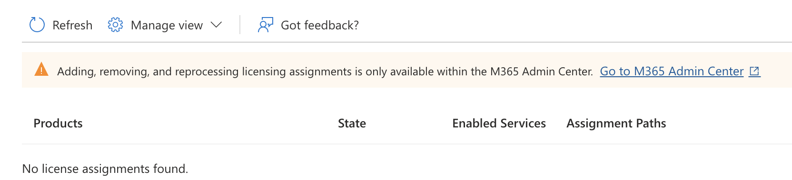

## Users And Groups

## Users
1. **Cloud identities** - These users exist only in **Microsoft Entra ID**. Examples are administrator accounts and users that you manage yourself. Their source is Microsoft Entra ID or External Microsoft Entra directory if the user is defined in another Microsoft Entra instance but needs access to subscription resources controlled by this directory. When these accounts are removed from the primary directory, they're deleted.
2. **Directory-synchronized identities** - These users exist in an on-premises Active Directory. A synchronization activity brings these users into Microsoft Entra ID. **Microsoft Entra Cloud Sync** is the recommended synchronization tool for most organizations—it uses a lightweight cloud-managed agent and supports multiple disconnected forests. **Microsoft Entra Connect Sync** remains available for complex scenarios such as device synchronization or groups with more than 50,000 members. Their source is **Windows Server AD**.
3. **Guest users** - These users exist **outside** your organization. Examples are accounts from other cloud providers and Microsoft accounts. Their source is Invited user. This type of account is useful when external vendors or contractors need access to your organization's resources. Once their help is no longer necessary, you can remove the account and all of their access. 

### Add User
1. Best managed in **entra.microsoft.com**
2. Cloud Identities can include properties like:
    - Job title
    - Parental Controls
    - Usage location (required for licensing purposes)
3. Support custom domain, but have to be included first.

### Delete Users
1. Soft Delete - Users are soft deleted and can be restored within 30 days.
2. Hard Delete - Users are hard deleted and cannot be restored.
3. Permission required to restore or delete users is **User Administrator** or **Global Administrator** or **Partner Tier 1 Support** or **Partner Tier 2 Support**.

## Groups
1. Group types:
    - **Microsoft 365 Groups** - Groups that are used to collaborate with other users. They have a shared mailbox, calendar, and other resources. This option also lets you give people outside of your organization access to the group. This option is available to users and admins.
    - **Security Groups** - Groups that are used to manage access to resources. Members of a security group can include users, devices, and service principals. **This option requires a Microsoft Entra administrator.**
2. Membership types:
    - **Assigned** - members are added and maintained manually.
    - **Dynamic User** - Users are added and removed automatically based on rules that evaluate user attributes such as department, job title, or location. **Requires P1/P2 license.**
    - **Dynamic Device** - Devices are added and removed automatically based on rules that evaluate device attributes such as department, job title, or location. **Requires P1/P2 license.**

## Microsoft Entra joined devices
1. Any organization can deploy Microsoft Entra joined devices no matter the size or industry. 
2. Controlled with Mobile Device Management.
3. Can join as hybrid with on-prem AD.
4. No longer supports device writeback. Use Cloud Kerberos Trust which allows Microsoft Entra joined and hybrid joined devices to authenticate to on-premises resources without requiring device objects to be written back to on-premises Active Directory.

## License Assignment to Users
1. Can be managed through:
    - Microsoft 365 admin center
    - PowerShell
    - Microsoft Graph API

    
2. Select Billing from the menu on the left.
3. Select Licenses.
4. From the list of licenses you have available, select one.
5. Select Groups from the list near the top of the screen.
6. On the Groups page, select + Assign license.